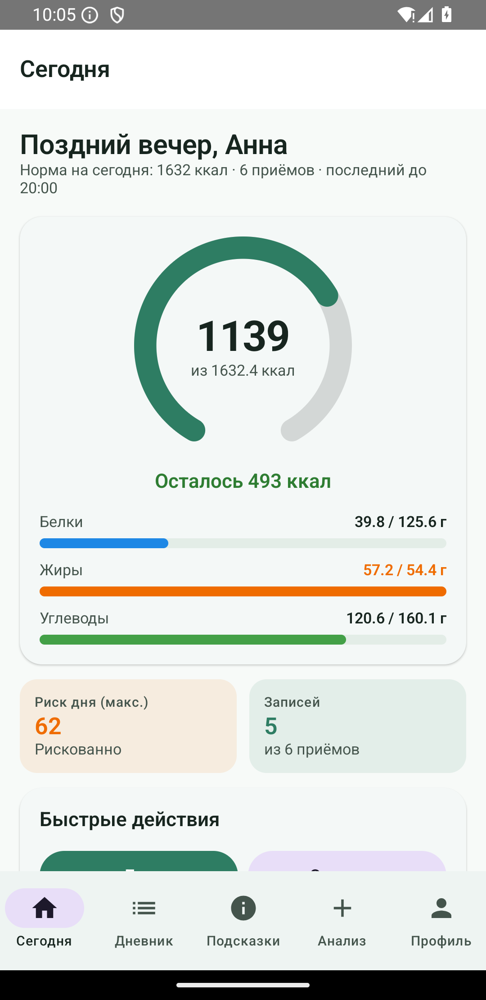
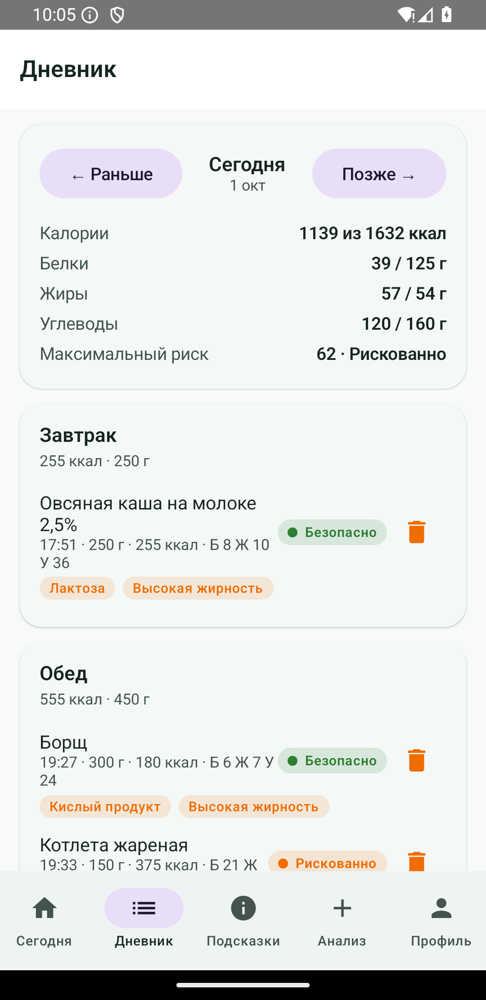
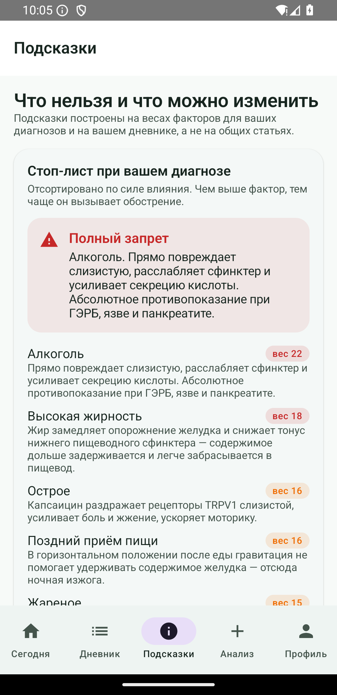
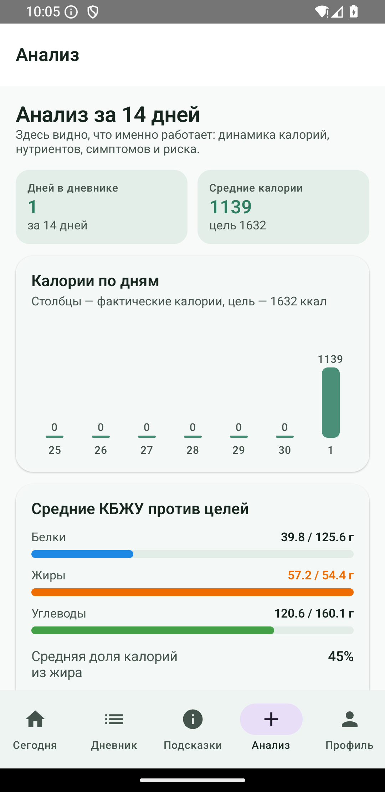
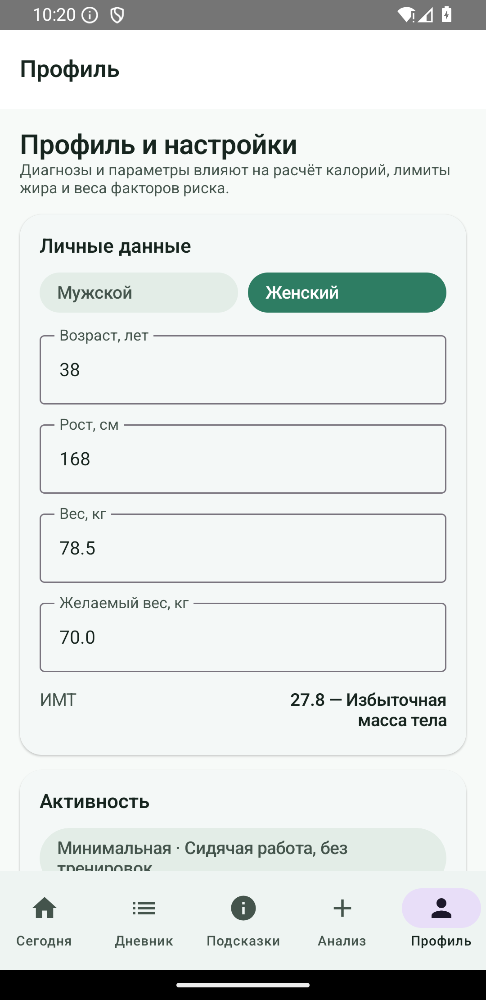
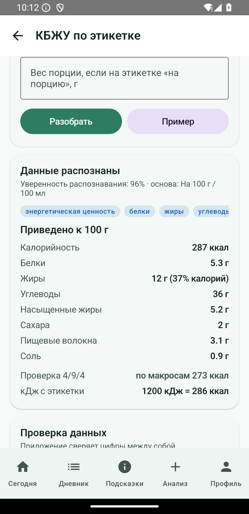
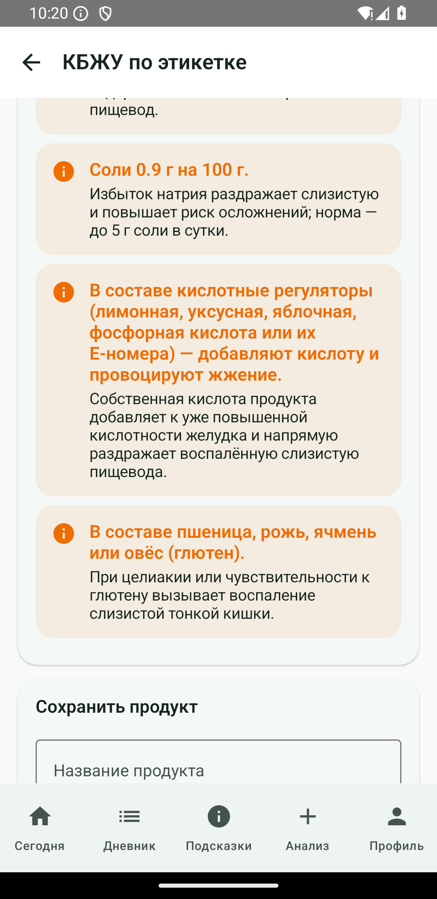

# ГастроКомпас

**Android-приложение для людей с ГЭРБ, гастритом, язвенной болезнью, СРК, болезнями желчного пузыря
и поджелудочной железы — дневник питания, который не просто считает калории, а предупреждает
обострения.**

Полностью офлайн, без рекламы, аналитики и передачи данных. Kotlin + Jetpack Compose, Material 3.

---

## Содержание

- [Задача проекта](#задача-проекта)
- [Что умеет приложение](#что-умеет-приложение-полный-функционал)
- [Оценка полезности для целевой аудитории](#оценка-полезности-для-целевой-аудитории)
- [Скриншоты и проверка на устройстве](#скриншоты-и-проверка-на-устройстве)
- [Технические детали](#технические-детали)
- [Сборка](#сборка)
- [Ограничения](#ограничения)
- [Дальнейшее развитие](#дальнейшее-развитие)
- [Медицинский дисклеймер](#медицинский-дисклеймер)

---

## Задача проекта

### Проблема

При заболеваниях верхних отделов ЖКТ питание — не «дополнительная рекомендация», а часть
лечения и профилактики обострений. Пациент с ГЭРБ, гастритом или язвой оказывается
между двумя противоположными задачами:

1. **Не спровоцировать приступ.** У каждого диагноза свой набор триггеров: жир и жареное
   ослабляют нижний пищеводный сфинктер, кислое и острое раздражают слизистую, объём порции
   повышает внутрижелудочное давление, поздний ужин вызывает ночную изжогу, лук, чеснок
   и бобовые дают вздутие при СРК, жирная нагрузка опасна при ЖКБ и панкреатите.
2. **Управлять калориями.** При избыточном весе снижение массы тела уменьшает симптомы
   рефлюкса, а при дефиците массы набор веса нужен для заживления. Но привычные калькуляторы
   калорий предлагают агрессивный дефицит и жёсткие схемы голодания, которые при болезнях ЖКТ
   как раз и приводят к обострению: голод повышает кислотность, быстрая потеря веса
   усиливает рефлюкс, а мобилизация жира при ЖКБ может спровоцировать приступ.

Существующие приложения закрывают только одну половину: либо «считалку калорий», в которой
для ГЭРБ нет ни слова о рисках, либо справочник «запрещённых продуктов» без калорий,
порций и связи с реальным дневником. Плюс раздражение от ввода данных: КБЖУ продукта
на этикетке часто указано так, что человек ошибается в 2–10 раз («на порцию», а не на 100 г;
кДж вместо ккал; «в т.ч. насыщенные»; «следы»).

### Что требовалось сделать

| Требование | Как реализовано |
|---|---|
| Интеллектуальные подсказки о том, что не стоит есть, чтобы не вызвать приступ и рецидив | Движок риска: 24 фактора × 13 диагнозов × интенсивность фактора + контекст приёма (время, натощак, накопленный жир, текущие симптомы, объём порции). Итог — шкала 0–100, уровень риска от «безопасно» до «избегать», объяснение механизма, безопасные замены и максимальный безопасный вес порции |
| Подсчёт калорий и советы по снижению или добору без вреда для здоровья при диагнозе | Расчёт по Миффлину–Сан Жеору с поправкой на диагноз: дефицит не более 20% (15% при ЖКБ и панкреатите), «пол» калорийности, лимиты жира, сахара, соли, кофеина, 12 автоматических проверок дня, отдельные памятки «как снижать» и «как безопасно добрать» вес |
| Реализация для Android | Kotlin, Jetpack Compose, Material 3, minSdk 24 (Android 7.0+), APK ~9 МБ |
| Варианты определения КБЖУ по этикетке | 8 вариантов функционала, 5 реализовано; разбор текста этикетки с автопроверками (кДж→ккал, приведение к 100 г, формула 4/9/4, соль из натрия, «следы»), ручной ввод, калькулятор блюда, пересчёт «упаковка → порция», оценка риска по составу |

### Целевая аудитория

**Основная:**

* пациенты с подтверждённым диагнозом ГЭРБ (включая эрозивную форму и пищевод Барретта),
  гастритом, язвенной болезнью, функциональной диспепсией, СРК, ЖКБ/дискинезией,
  хроническим панкреатитом в ремиссии, лактазной недостаточностью, целиакией;
* люди с избыточной массой тела, которым врач рекомендовал снижение веса на фоне
  гастроэнтерологического диагноза;
* пациенты с дефицитом массы тела, которым нужно безопасно добрать калории, не перегружая ЖКТ.

**Дополнительная:**

* люди без подтверждённого диагноза, но с регулярной изжогой и тяжестью — для профилактики
  и для сбора объективных данных перед визитом к врачу;
* те, кто уже ведёт дневник питания, но хочет видеть не только калории, а последствия
  для своего состояния.

**Кому приложение не нужно:** людям без жалоб и без цели контролировать питание;
тем, кто ищет замену врачу и лечению.

---

## Что умеет приложение (полный функционал)

### 1. Профиль, диагноз и расчёт норм

* **13 диагнозов и состояний**: ГЭРБ, пищевод Барретта, грыжа пищеводного отверстия диафрагмы,
  гастрит с повышенной и пониженной кислотностью, язвенная болезнь, функциональная диспепсия,
  СРК, ЖКБ и дискинезия желчевыводящих путей, хронический панкреатит, лактазная недостаточность,
  целиакия, профилактический режим.
* **11 симптомов** (изжога, регургитация, боль, вздутие, тошнота, отрыжка, ночной кашель,
  горечь, диарея, запор, раннее насыщение) и **9 «красных флагов»** (дисфагия, потеря веса,
  кровотечение, анемия, неукротимая рвота, ночные боли, боль в груди, дебют после 50 лет,
  длительный приём ИПП).
* Антропометрия, активность, цель (снизить / удержать / набрать вес), время отхода ко сну,
  число приёмов пищи, личные триггеры (усиливают вес фактора в 1,6 раза).
* Пересчёт норм «на лету» при любом изменении профиля.

### 2. Дневник питания

* Записи по приёмам пищи (завтрак, обед, перекус, ужин, поздний перекус) с временем, весом порции
  и снимком КБЖУ — история не «плывёт» при правках справочника.
* Для каждой записи — **балл риска и уровень** (безопасно / умеренно / рискованно / избегать)
  и чипы факторов («Высокая жирность», «Кислый продукт», «Лактоза»).
* Навигация по дням, итоги дня, удаление записей, журнал симптомов и история взвешиваний.
* **Справочник 238 продуктов** с КБЖУ на 100 г, разметкой факторов риска, пометкой «зелёной зоны»,
  типовыми порциями и заменами; 17 категорий; поиск; пользовательские продукты.

### 3. Подсчёт калорий и КБЖУ

* BMR по формуле Миффлина–Сан Жеора (со скорректированной массой тела при ИМТ > 35), TDEE
  по коэффициенту активности.
* Безопасные границы: дефицит ≤ 20% (≤ 15% и ≤ 400 ккал при ЖКБ и панкреатите), профицит
  ≤ 10–15% и ≤ 400 ккал, «пол» калорийности 1200/1500 ккал и по диагнозу, безопасный темп
  0,5–1% массы тела в неделю.
* Распределение БЖУ: белок 1,1–1,6 г/кг, жир ограничен долей калорий по самому строгому диагнозу
  (20% панкреатит, 22% ЖКБ, 28–30% ГЭРБ/язва/гастрит), углеводы — остаток, но не менее 30%.
* Дополнительные лимиты: насыщенные жиры, сахар (5% калорий при ГЭРБ/СРК/диспепсии),
  соль (5 г), кофеин (200 мг), клетчатка (22–28 г), вода.
* **План приёмов пищи** с распределением нормы по 3–6 приёмам и сравнением «факт / цель».
* **12 проверок дня**: недобор калорий, опасно низкая калорийность, превышение жира,
  насыщенных жиров, сахара, соли, кофеина, мало белка, мало клетчатки, мало приёмов,
  поздний последний приём, продукты из рисковой зоны.
* **Недельная корректировка** по фактическому тренду веса с кнопкой «Применить ±100/150 ккал»
  (поправка ограничена безопасным минимумом).

### 4. Умные подсказки о рисках

* **24 фактора риска** с механизмом действия: жир, жареное, кислота, цитрусовые, томаты, острое,
  кофеин, мята, шоколад, газирование, алкоголь, грубая клетчатка, лук и чеснок, копчёное и солёное,
  лактоза, глютен, FODMAP, сахар, соль, очень горячее, очень холодное, объём порции,
  приём натощак, поздний приём.
* **Веса факторов зависят от диагноза.** Пример: жир — 18 при ГЭРБ, 20 при ЖКБ, 22 при панкреатите;
  FODMAP — 20 при СРК и 5 при ГЭРБ; алкоголь — 22–25 и жёсткий запрет.
* **Жёсткие запреты**: алкоголь при ГЭРБ, Барретте, грыже, гастрите, язве, ЖКБ, панкреатите;
  глютен при целиакии — продукт всегда получает уровень «избегать».
* **Учёт контекста**: приём натощак (×1,25), менее 3 часов до сна (×1,35), ночной приём (×1,20),
  симптомы за последние сутки (×1,15), превышение дневного лимита жира (×1,10), уже случившийся
  продукт из красной зоны (×1,10), превышение калорий (×1,08).
* **Объяснение, а не ярлык:** «Порция содержит 27 г жира. Жирная пища задерживается в желудке
  дольше и ослабляет сфинктер — это самая частая причина приступов».
* **Безопасные замены** с меньшим риском и похожей калорийностью + **максимальный безопасный
  вес порции**, рассчитанный перебором до порога «зелёной» зоны.
* **Положительные стороны** продукта (мягкая клетчатка, белок, низкая доля калорий из жира).
* **Стоп-лист по диагнозу**: факторы, отсортированные по силе влияния, с механизмами;
  блок «полный запрет».

### 5. Симптомы и персональные закономерности

* Быстрая фиксация симптома с выраженностью 1–3 и временем; связь с последними приёмами пищи.
* **Статистика по вашему дневнику:** приложение сравнивает, как часто симптомы появлялись
  в течение 4 часов после приёмов с определённым фактором, с фоновой частотой. При отношении
  частот ≥ 1,8 и минимум 3 наблюдениях выводится вывод с числами: «симптомы после этого фактора
  в 6 случаях из 7 (86%), в среднем — 22%» — и предложение добавить фактор в личные триггеры.
* Отдельно ищутся конкретные продукты, совпадающие с симптомами, и «серии» поздних ужинов.
* Дни без симптомов подряд, частота обострений за 14 дней, «красные флаги».

### 6. Безопасное управление весом

* Памятки «как снижать калории без обострений» (уменьшать объём, а не число приёмов; сначала убирать
  жир; не пить калории; белок в каждый приём; не голодать; мягкие овощи вместо грубых;
  безопасный темп; движение без наклонов после еды).
* Памятки «как безопасно добрать калории» (калорийная плотность вместо объёма, дополнительные
  приёмы, жидкие калории без кислоты, ограничения при панкреатите и лактазной недостаточности).
* Арифметика дефицита в открытом виде: BMR, TDEE, дефицит, ожидаемый темп, объяснение,
  почему жёсткие диеты и интервальное голодание не подходят.

### 7. КБЖУ по этикетке — 8 вариантов функционала

| № | Вариант | Статус |
|---|---|---|
| 1 | Ручной ввод по таблице с выбором основы (на 100 г / на порцию / на упаковку) | ✅ |
| 2 | Разбор вставленного текста этикетки (русские обозначения, кДж, «следы», «в т.ч.») | ✅ |
| 3 | Фото этикетки, OCR на устройстве (ML Kit Text Recognition v2) | 🔜 |
| 4 | Штрихкод + офлайн-база Open Food Facts | 🔜 |
| 5 | Голосовой ввод с разбором единиц («полтора стакана») | 🔜 |
| 6 | Калькулятор блюда и правило «сухой продукт → готовое» | ✅ |
| 7 | Пересчёт «упаковка → порция», мл ↔ г по плотности | ✅ |
| 8 | «Этикетка → сразу риск для ЖКТ» по составу | ✅ |

Что делает разбор этикетки:

* понимает «на 100 г», «в 100 г», «на 100 мл», «на 1 порцию (30 г)», «на упаковку»,
  «масса нетто 250 г», «объём 0,5 л»;
* различает основные поля и подчинённые: «в т.ч. насыщенные жирные кислоты», «в т.ч. сахара»,
  «пищевые волокна», «соль», «натрий», «кофеин»;
* переводит кДж → ккал (÷4,184), считает соль из натрия (×2,5), трактует «следы» и «менее 0,1»
  как 0,05 г;
* приводит значения к 100 г и показывает **уверенность распознавания**;
* **проверяет цифры**: сумма макросов > 100 г — ошибка; калорийность сверяется с макросами
  по формуле 4/9/4 (расхождение > 20% — предупреждение, > 35% — ошибка); кДж сверяются с ккал;
  эвристика «похоже, это значения на порцию, а не на 100 г»;
* **сразу оценивает риск по составу**: кислотные регуляторы (E330, E260, E296, E338),
  кофеин, какао, мята, томаты, цитрусовые, лук и чеснок, газирование, алкоголь, лактоза, глютен,
  FODMAP, жареное, копчёное — с механизмом действия;
* сохраняет продукт в справочник или сразу добавляет в дневник.

### 8. Аналитика

* Калории по дням за 14 дней, средние КБЖУ против целей, средняя доля калорий из жира.
* Структура риска: сколько приёмов в каждой зоне за неделю.
* Частота симптомов по типам, самые рискованные продукты недели, найденные закономерности.
* Дисциплина питания: дни в целевом коридоре, отклонение от нормы, оценка тренда.
* Вес: история взвешиваний, темп изменения, рекомендация по калориям.

### 9. Данные и приватность

* Всё хранится локально (SharedPreferences + JSON). Ни одного сетевого запроса, нет рекламы
  и аналитики — в манифесте нет разрешения `INTERNET`.
* Экспорт дневника в JSON через системное «Поделиться» (можно отправить врачу).
* Полное удаление данных одной кнопкой (с возвратом к онбордингу).

---

## Оценка полезности для целевой аудитории

Оценка сделана честно, с указанием слабых мест — без маркетинговых преувеличений.

### Сводная оценка

| Критерий | Оценка | Обоснование |
|---|---|---|
| Актуальность проблемы | 5/5 | Питание — первая линия поведенческих мер при ГЭРБ и большинстве заболеваний ЖКТ; при этом пациентам обычно дают общий список «не ешьте острое и жареное» без учёта индивидуальных триггеров |
| Ежедневная применимость | 4/5 | Приложение используется 3–6 раз в день (каждый приём пищи), встраивается в текущие привычки, работает офлайн и без регистрации |
| Влияние на симптомы | 3,5/5 | Диета реально снижает частоту симптомов, но это одна из мер: при ГЭРБ ключевые — снижение веса, подъём изголовья, отказ от поздних ужинов и терапия ИПП. Приложение помогает соблюдать эти меры, но не заменяет их |
| Точность рекомендаций | 3,5/5 | Веса факторов — экспертная эвристика на основе общих клинических принципов, а не индивидуальный прогноз. Часть риска компенсируется персональной статистикой по вашему дневнику, но клинической валидации у приложения нет |
| Удержание пользователя | 3/5 | Главный риск любого дневника — бросить через 1–2 недели. Частично лечится подсказками и «быстрым добавлением», но честно: это слабое место, и roadmap это учитывает |
| Ценность для врача | 4/5 | Дневник с симптомами, временем приёмов и факторами — объективные данные для приёма, лучше устных воспоминаний. Экспорт в JSON уже есть, PDF-отчёт — в планах |
| Широта аудитории | 4/5 | 13 диагнозов покрывают большинство обращений к гастроэнтерологу; при этом приложение не для здоровых людей без жалоб |
| Приватность | 5/5 | Нет сети, нет аккаунтов, нет аналитики; данные можно удалить одной кнопкой |

**Итоговая оценка: 4/5 как инструмент самоконтроля для мотивированного пациента.**
Это не медицинское изделие и не замена врачу, но как «умный дневник с предупреждениями»
приложение закрывает реальную потребность, которую массовые калорийные трекеры игнорируют.

### Кому приложение даст больше всего

1. **Пациент с ГЭРБ и избыточным весом**, которому рекомендовано похудеть. Здесь приложение
   закрывает сразу две задачи: находит продукты-триггеры и не даёт уйти в опасный дефицит.
2. **Пациент с частыми обострениями без понятной причины.** Ценность — в поиске личных
   закономерностей: человек часто винит «стресс», а статистика показывает связь с поздними
   ужинами или с конкретным продуктом.
3. **Пациент с несколькими диагнозами сразу** (например, ГЭРБ + ЖКБ + СРК). Здесь особенно
   заметна разница с общими советами: рекомендации по жиру, FODMAP и объёму порций
   строятся по самому строгому диагнозу.
4. **Пациент с дефицитом массы тела** (после обострения, при атрофическом гастрите), которому
   нужно набрать вес без больших порций и жирной пищи.

### Где приложение слабее

* **Мотивация и привычка.** Самое сложное в любом дневнике — регулярность. Без напоминаний
  и «одного тапа» на добавление еды часть пользователей бросит ведение записей через 1–2 недели.
* **Оценка размера порции «на глаз».** Точность КБЖУ ограничена точностью взвешивания;
  оценка порций по фотографии сюда не входит.
* **Готовые блюда вне дома.** КБЖУ блюд в кафе всегда оценочное — приложение об этом
  предупреждает, но точность падает.
* **Сложные и сочетанные случаи.** При тяжёлом течении, анемии, дефиците массы тела,
  после операций на желудке и пищеводе нужен врач и диетолог, а не эвристика приложения.
* **Отсутствие клинической валидации.** Приложение не проверялось в исследованиях; веса
  факторов основаны на общих принципах, а не на измеренном эффекте.

### Потенциальные риски использования (и как они закрыты)

| Риск | Что делает приложение |
|---|---|
| Пациент откладывает визит к врачу из-за «у меня же есть приложение» | 9 «красных флагов» с прямыми указаниями действий, включая «немедленно вызвать скорую»; напоминание, что приложение не ставит диагноз |
| Самостоятельный агрессивный дефицит калорий | Жёсткий «пол» калорийности, ограничение дефицита, проверка «опасно низкая калорийность» как ошибка дня, памятка «не голодайте» |
| Отказ от назначенной терапии | Явная рекомендация не отменять ИПП самостоятельно, отдельные подсказки при пищеводе Барретта и длительном приёме ИПП |
| Слишком строгие самоограничения и «диетическая орторексия» | Подсказки про безопасные замены и «зелёную» зону вместо тотальных запретов; отдельные советы по мягкой клетчатке и набору веса |
| Ложные выводы из-за малой выборки | Персональные закономерности выводятся только при ≥ 3 наблюдениях и отношении частот ≥ 1,8, всегда с числами |

### Ожидаемый эффект

* **Короткий срок (1–2 недели):** пользователь видит, какие продукты и в какое время дают
  симптомы, и убирает самые очевидные триггеры (поздние ужины, жареное, газировка).
* **Средний срок (1–2 месяца):** формируется привычный безопасный рацион; при цели снижения
  веса — 2–4 кг без обострений; появляется объективная история для врача.
* **Длинный срок (6+ месяцев):** поддержание ремиссии и удержание веса; при регулярном
  заполнении — статистика, которую можно обсуждать с гастроэнтерологом.

---

## Скриншоты и проверка на устройстве

Приложение собрано и проверено на эмуляторе **Pixel 3a, Android 15 (x86_64)**: все экраны
открываются и работают, APK устанавливается через `adb install`.

| Экран | Скриншот |
|---|---|
| Дашборд: калории, БЖУ, риск дня |  |
| Дневник с риск-оценкой блюд |  |
| Стоп-лист и подсказки по диагнозу |  |
| Анализ за 14 дней |  |
| Профиль и расчёт норм |  |
| КБЖУ по этикетке: разбор таблицы |  |
| Этикетка → факторы риска по составу |  |

Воспроизведение проверки:

```powershell
adb install -r dist\GastroCompass-debug.apk
powershell -ExecutionPolicy Bypass -File tools/seed-demo-data.ps1   # демо-профиль и дневник
# «Сегодня» → прокрутить → «Этикетка» → «Пример» → «Разобрать»
```

Подробный отчёт о проверке и найденных дефектах — в [`docs/verification.md`](docs/verification.md).

---

## Технические детали

### Стек

| Компонент | Версия / решение |
|---|---|
| Язык | Kotlin 1.9 |
| UI | Jetpack Compose (BOM 2024.04.01), Material 3 1.2.1 |
| Сборка | AGP 8.6.0, Gradle 8.7 |
| Минимум | minSdk 24 (Android 7.0), targetSdk 34 |
| Хранение | SharedPreferences + JSON, без Room и сети |
| Тесты | JUnit 4, 55 unit-тестов на JVM |
| Навигация | собственный стек экранов на состоянии Compose (без navigation-compose) |
| Зависимости | только AndroidX и Compose — ни одной сторонней библиотеки |

Приложение не запрашивает разрешение `INTERNET`, не содержит SDK аналитики и рекламы.

### Архитектура

```
app/src/main/java/com/gastrocare/compass/
├── MainActivity.kt                 — единственная activity, создаёт хранилище
├── domain/                         — чистая логика без зависимостей от Android
│   ├── model/                      — TriggerTag (24 фактора), Food, Profile (13 диагнозов),
│   │                                 Diary, Risk, Targets, LabelScan
│   └── engine/
│       ├── RiskEngine.kt           — баллы риска, контекст, замены, безопасный объём порции
│       ├── TargetCalculator.kt     — калории, БЖУ, безопасный дефицит и профицит, проверки дня
│       ├── InsightEngine.kt        — персональные закономерности и корреляции
│       ├── LabelTextParser.kt      — разбор этикетки и проверки
│       └── RecipeCalculator.kt     — блюдо, ужарка/уварка, «сухой → готовый»
├── data/                           — справочник 238 продуктов, SharedPreferences + JSON
└── ui/                             — тема, компоненты, 9 экранов
```

Ключевое архитектурное решение: **любой источник КБЖУ** (ручной ввод, текст этикетки, будущие OCR,
штрихкод, голос, рецепт) приводит данные к одному типу `Nutrition` на 100 г. Дальше работает
один и тот же код проверки, оценки риска и записи в дневник — поэтому способы взаимозаменяемы
и добавляются без правок бизнес-логики.

Доменные движки не зависят от Android и покрыты unit-тестами.

### Алгоритмы (кратко)

* **Риск:** `баллы = 100 × (1 − exp(−сырой_балл / 55))`, где сырой балл — сумма вкладов
  `вес фактора при диагнозе × интенсивность`, плюс поправки на жир и объём порции, всё умножается
  на контекстные коэффициенты. Уровни: < 25 безопасно, 25–49 умеренно, 50–74 рискованно, ≥ 75 избегать.
* **Калории:** Миффлин–Сан Жеор → TDEE → дефицит с двумя ограничениями (процент и абсолют) →
  «пол» калорийности → БЖУ остатком с приоритетом белка и лимита жира.
* **Персональные триггеры:** доля симптомных эпизодов после приёма с фактором против фоновой доли,
  порог отношения 1,8 и минимум 3 наблюдения.
* **Этикетка:** нормализация с сохранением длины строки → выделение области таблицы → маскировка
  мешающих фраз → извлечение полей по «неизрасходованным» числам → приведение к 100 г →
  проверки (4/9/4, сумма макросов, кДж/ккал, эвристика «это значения на порцию»).

### Тесты и проверка

55 unit-тестов, все проходят: разбор этикеток (20), риск-движок (14), расчёт калорий (21).
Тесты нашли четыре реальных дефекта — бесконечную рекурсию в подборе замен, нечувствительность
`\w` к кириллице, ложное определение «лимонной кислоты» как цитрусовых и (уже на устройстве)
падение приложения из-за флага `(?U)`, который не поддерживает ICU-регулярки Android.
Подробности — в [`docs/verification.md`](docs/verification.md).

---

## Сборка

### Требования

* Android SDK с платформой **android-34**; JDK 17+; Gradle 8.7 (есть wrapper).

### Обычная сборка

```bash
./gradlew :app:assembleDebug        # APK: app/build/outputs/apk/debug/app-debug.apk
./gradlew :app:testDebugUnitTest    # unit-тесты движков
```

Проект открывается в Android Studio напрямую: `File → Open → GastroCompass`.

### Непрерывная интеграция

В репозитории есть workflow [`.github/workflows/android.yml`](.github/workflows/android.yml):
на каждый push и pull request собирается APK и прогоняются тесты, артефакты (APK и XML-отчёты)
публикуются в разделе Actions.

### Сборка в офлайн-среде

```powershell
powershell -ExecutionPolicy Bypass -File tools/build.ps1              # тесты + APK
powershell -ExecutionPolicy Bypass -File tools/build.ps1 -SkipTests   # только APK
```

Скрипт решает три проблемы изолированного окружения: тесты запускаются в ASCII-зеркале проекта
(JVM-воркер Gradle не грузит классы из пути с кириллицей), `GRADLE_USER_HOME` указывает
на локальную копию кэша зависимостей, сборка идёт с `--offline`.
Подпись debug-сборки задана ключом внутри проекта (`keystore/debug.keystore`), потому что
в изолированной среде AGP не может создать `~/.android/debug.keystore`.

---

## Ограничения

* **Не медицинское изделие.** Не ставит диагноз, не назначает лечение, не интерпретирует анализы.
* **Справочник — 238 позиций.** Осознанный компромисс для офлайн-приложения; пользовательские
  продукты и разбор этикеток закрывают остальное.
* **Оценка риска — эвристика.** Веса факторов основаны на общих клинических принципах;
  клинической валидации приложения не проводилось.
* **Разбор этикетки** поддерживает русские обозначения; английские подписи распознаются частично
  (калорийность — да, макронутриенты — нет).
* **Точность КБЖУ** ограничена точностью взвешивания и добросовестностью производителя;
  блюда вне дома всегда оценочны.
* **Проверено на Android 15.** Использованы только стабильные API (minSdk 24), но полный прогон
  на Android 7–13 не выполнялся.
* **Производительность** на больших дневниках (сотни записей) не измерялась.

---

## Дальнейшее развитие

Подробный разбор вариантов с оценкой пользы, сложности и рисков — в
[`docs/roadmap.md`](docs/roadmap.md). Коротко, по приоритетам:

**Ближайшее (усиление того, что уже есть):**

1. Напоминания и уведомления (приёмы пищи, вода, взвешивание, «за 3 часа до сна»).
2. Виджет и быстрые действия: добавить воду/перекус/симптом в один тап.
3. PDF-отчёт для врача (КБЖУ, симптомы, риск, тренд веса за период).
4. Домашний экран «что съесть сейчас» с учётом времени до сна и остатка лимита жира.
5. Резервное копирование и перенос между устройствами (файл + шифрование).

**Данные и ввод:**

6. OCR этикетки (ML Kit), 7. штрихкод + Open Food Facts, 8. голосовой ввод, 9. оценка порции
по фото, 10. библиотека готовых безопасных рецептов и планировщик меню на неделю со списком покупок.

**Клинические сценарии:**

11. Трекер лекарств (ИПП, ферменты) и связь самочувствия с приёмом.
12. Пошаговый протокол низкого FODMAP с этапом возврата продуктов (для СРК).
13. Журнал «стоп-продукт на 2 недели» с автоматической оценкой эффекта исключения.
14. Режим подготовки к приёму врача (сводка за 7/14/30 дней).
15. Поддержка особых групп: беременность, дети (по назначению врача), послеоперационные диеты.

**Платформа:**

16. Wear OS и Google Fit / Health Connect (шаги, сон, вес), 17. планшет и складные устройства,
18. локализация (en, kk, uz), 19. доступность (крупный шрифт, TalkBack),
20. шифрование локальной базы.

**Исследовательское:**

21. Клиническая валидация весов факторов, 22. обучение на обезличенных данных с согласия
пользователя (только локально, без отправки), 23. персональные рекомендации порций на основе
истории, 24. интеграция с врачом (веб-кабинет, приём дневника по QR-коду).

**Чего делать не стоит:** автоматически ставить диагнозы, рекомендовать препараты и дозы,
предлагать жёсткие диеты и голодание, использовать ИИ для «диагноза по фото» — это выходит
за рамки безопасности потребительского приложения.

---

## Медицинский дисклеймер

ГастроКомпас — помощник в соблюдении диеты и наблюдении за состоянием. Приложение **не является
медицинским изделием**, не ставит диагноз, не назначает лечение и не заменяет консультацию врача.
Все решения о питании, диагностике и терапии принимайте вместе с гастроэнтерологом или диетологом.
При затруднённом глотании, необъяснимой потере веса, крови в стуле или рвоте, ночных болях
и боли в груди — обратитесь за медицинской помощью немедленно, а не пытайтесь корректировать диету.

Перед публикацией в магазине приложений рекомендуется юридическая проверка медицинских
формулировок: в ряде юрисдикций приложения, дающие рекомендации по питанию при заболеваниях,
требуют явной пометки «не является медицинским изделием» и согласования текстов предупреждений.

Код проекта можно свободно использовать и изменять.
